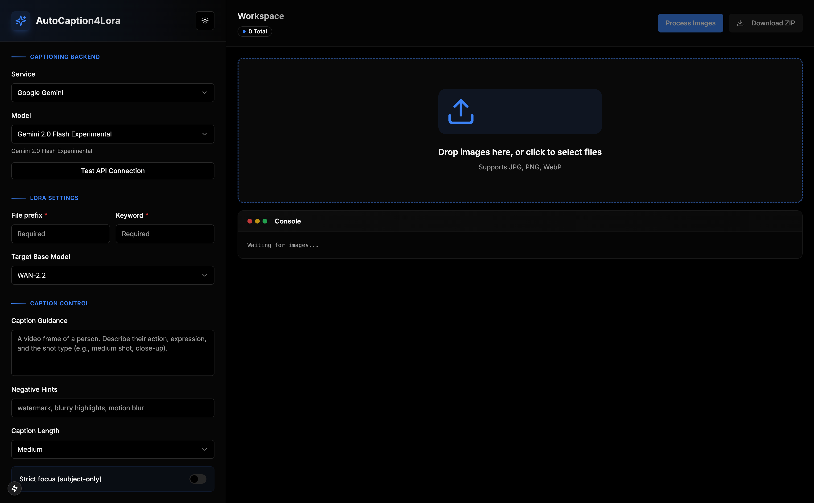

# AutoCaption4Lora

<div align="center">
  <h3>🎨 AI-Powered Image Captioning for LoRA Training Datasets</h3>
  <p>Automatically generate high-quality captions for your image training datasets using Google's Gemini AI</p>
  
  
  
  
  
</div>

## 📸 Preview

<div align="center">
  
</div>

---

## ✨ Features

- 🤖 **AI-Powered Captioning** - Leverages multiple AI vision models for accurate image descriptions
- 🔌 **Multi-Provider Support** - Choose from Google Gemini, OpenAI, OpenRouter, Together AI, Groq, or local Ollama
- 🎯 **LoRA-Optimized** - Captions formatted specifically for LoRA training workflows
- 🎨 **Modern UI** - Beautiful, responsive interface with real-time progress tracking
- 📦 **Batch Processing** - Process multiple images efficiently with rate limiting
- ⚙️ **Highly Configurable** - Control caption length, focus, guidance, and more
- 💾 **ZIP Export** - Download all processed images with captions in one click
- 🔄 **Multiple Models** - Support for various AI models across different providers
- 📊 **Progress Tracking** - Visual status indicators for each image (pending/processing/completed/error)
- 🎭 **Checkpoint Support** - Optimized for WAN-2.2, SDXL, FLUX, and Pony Diffusion

## 🚀 Quick Start

### Prerequisites

- Node.js 18+
- npm or yarn
- At least one AI provider API key (see [Supported Providers](#supported-providers))

### Installation

1. **Clone the repository**
   ```bash
   git clone https://github.com/MandarGogate/AutoCaption4Lora.git
   cd AutoCaption4Lora
   ```

2. **Install dependencies**
   ```bash
   npm install
   ```

3. **Set up environment variables**
   ```bash
   cp .env.example .env
   ```

   Edit `.env` and add your API keys for the providers you want to use:
   ```env
   # At least one provider is required
   GEMINI_API_KEY=your_gemini_api_key_here
   OPENAI_API_KEY=your_openai_api_key_here
   OPENROUTER_API_KEY=your_openrouter_api_key_here
   TOGETHER_API_KEY=your_together_api_key_here
   GROQ_API_KEY=your_groq_api_key_here
   OLLAMA_BASE_URL=http://localhost:11434/v1  # For local Ollama
   ```

   See [Supported Providers](#supported-providers) for details on obtaining API keys.

4. **Run the development server**
   ```bash
   npm run dev
   ```

5. **Open your browser**
   Navigate to [http://localhost:3000](http://localhost:3000)

## 📖 Usage

1. **Select Settings**
   - Choose your AI provider (Gemini, OpenAI, OpenRouter, Together AI, Groq, or Ollama)
   - Select your preferred model from the provider
   - Set your training goal (Identity, Style, Object, or Concept)
   - Configure file prefix and trigger keyword
   - Select target base model (WAN-2.2, SDXL, FLUX, or Pony)

2. **Configure Captions**
   - Add custom caption guidance (optional)
   - Adjust guidance strength (0-1)
   - Set negative hints to exclude certain elements
   - Choose caption length (Short, Medium, or Long)
   - Enable strict focus for subject-only descriptions

3. **Upload Images**
   - Drag and drop images or click to select
   - Supports JPG, PNG, and WebP formats
   - Preview all uploaded images with status indicators

4. **Process & Download**
   - Click "Process Images" to start captioning
   - Monitor progress in real-time
   - Download ZIP file containing images and .txt caption files

## 🛠️ Tech Stack

- **Framework**: [Next.js 15](https://nextjs.org/) (App Router)
- **UI Library**: [React 19](https://react.dev/)
- **Language**: [TypeScript](https://www.typescriptlang.org/)
- **Styling**: [Tailwind CSS](https://tailwindcss.com/)
- **Components**: [shadcn/ui](https://ui.shadcn.com/)
- **AI**: [Google Gemini API](https://ai.google.dev/)
- **Icons**: [Lucide React](https://lucide.dev/)

## 🔌 Supported Providers

AutoCaption4Lora supports multiple AI vision providers:

### Google Gemini
- **API Key**: Get from [Google AI Studio](https://makersuite.google.com/app/apikey)
- **Models**: Dynamically fetched (Gemini 2.0 Flash, Gemini 1.5 Pro, etc.)
- **Features**: High-quality vision models, cost-effective

### OpenAI
- **API Key**: Get from [OpenAI Platform](https://platform.openai.com/api-keys)
- **Models**: GPT-4 Vision Preview, GPT-4 Turbo, GPT-4o, GPT-4o Mini
- **Features**: Industry-leading performance, comprehensive understanding

### OpenRouter
- **API Key**: Get from [OpenRouter](https://openrouter.ai/keys)
- **Models**: Claude 3.5 Sonnet, Claude 3 Opus, GPT-4 Vision, Gemini Pro Vision, Llama 3.2 90B Vision
- **Features**: Access to multiple models through a single API

### Together AI
- **API Key**: Get from [Together AI](https://api.together.xyz/settings/api-keys)
- **Models**: Llama 3.2 90B Vision Instruct Turbo, Llama 3.2 11B Vision Instruct Turbo
- **Features**: Fast inference, competitive pricing

### Groq
- **API Key**: Get from [Groq Console](https://console.groq.com/keys)
- **Models**: Llama 3.2 90B Vision Preview, Llama 3.2 11B Vision Preview
- **Features**: Ultra-fast inference with LPU technology

### Ollama (Local)
- **Setup**: Install [Ollama](https://ollama.ai/) and pull vision models (e.g., `ollama pull llava`)
- **Models**: LLaVA Latest, LLaVA 13B, LLaVA 34B, BakLLaVA
- **Features**: Run locally, no API costs, full privacy

## 📁 Project Structure

```
AutoCaption4Lora/
├── app/
│   ├── api/              # API routes
│   │   ├── download/     # ZIP download endpoint
│   │   ├── logs/         # Logging endpoint
│   │   ├── models/       # Model listing endpoint
│   │   ├── process/      # Image processing endpoint
│   │   ├── test/         # API testing endpoint
│   │   └── upload/       # Image upload endpoint
│   ├── globals.css       # Global styles
│   ├── layout.tsx        # Root layout
│   └── page.tsx          # Main page component
├── components/
│   └── ui/               # UI components (shadcn)
├── lib/
│   ├── gemini.ts         # Gemini API integration
│   ├── providers.ts      # Multi-provider LLM configurations
│   ├── store.ts          # File system storage
│   └── utils.ts          # Utility functions
├── public/               # Static assets
└── uploads/              # Temporary upload directory
```

## ⚙️ Configuration

### Caption Formatting

Captions are formatted based on your selected checkpoint:

- **WAN-2.2**: `{keyword}, {description} (neg: {negatives})`
- **SDXL**: `{keyword}, {description} (neg: {negatives})`
- **FLUX**: `{keyword}, {description} (neg: {negatives})`
- **Pony**: `{keyword}, {description} (neg: {negatives})`

### Environment Variables

| Variable | Description | Required |
|----------|-------------|----------|
| `GEMINI_API_KEY` | Google Gemini API key | Optional* |
| `OPENAI_API_KEY` | OpenAI API key | Optional* |
| `OPENROUTER_API_KEY` | OpenRouter API key | Optional* |
| `TOGETHER_API_KEY` | Together AI API key | Optional* |
| `GROQ_API_KEY` | Groq API key | Optional* |
| `OLLAMA_BASE_URL` | Ollama server URL | Optional* |

\* At least one provider must be configured

## 🤝 Contributing

Contributions are welcome! Please feel free to submit a Pull Request.

1. Fork the repository
2. Create your feature branch (`git checkout -b feature/AmazingFeature`)
3. Commit your changes (`git commit -m 'Add some AmazingFeature'`)
4. Push to the branch (`git push origin feature/AmazingFeature`)
5. Open a Pull Request

## 📝 License

This project is licensed under the MIT License - see the [LICENSE](LICENSE) file for details.

## 🙏 Acknowledgments

- [Google Gemini](https://ai.google.dev/) for the powerful vision AI
- [shadcn/ui](https://ui.shadcn.com/) for the beautiful component library
- [Next.js](https://nextjs.org/) team for the amazing framework

## 📞 Support

If you encounter any issues or have questions:
- Open an [issue](https://github.com/MandarGogate/AutoCaption4Lora/issues)
- Star ⭐ this repository if you find it helpful!

---

<div align="center">
  Made with ❤️ for the AI art community
</div>
